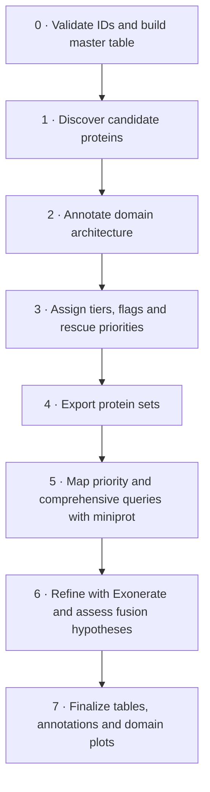

# FuNLR

**Fungal NLR discovery, classification and targeted gene-model rescue**

FuNLR discovers candidate fungal NOD-like receptor (NLR) proteins from an annotated genome. Python coordinates profile-HMM searches, domain architecture, evidence tiers, two genome-rescue tracks, annotation tagging and domain plots. It runs locally in one compute job, without requiring scheduler commands or a hosted service in the application.

**Version 0.5.0a2 is an alpha of the portable Python implementation of the original HPC workflow.** It is available as source and Python distributions for inspection, testing and early use. The current pipeline is rule based: evidence tiers are heuristics, and proposed gene-model rescues require review. The validation record distinguishes software tests from biological evidence.

**Start with the bundled demos.** They include the small inputs and profiles needed to test an installation. Analyses of your own genomes require separately supplied production fungal HMMs; a public model bundle, Conda package and container images are not yet available. See the [release notes](docs/RELEASE_NOTES.md), [validation record](docs/VALIDATION.md) and [model setup](docs/DATABASES.md).

[Install](#install-and-check) · [Run your data](#run-your-data) · [Batch](#tsv-driven-batch-runs) · [Results](#results-and-review) · [Troubleshooting](docs/TROUBLESHOOTING.md) · [Roadmap](#planned-functionality)

## Why fungal NLRs?

A common fungal NLR architecture combines an N-terminal **output domain**, a central nucleotide-binding domain (**NBD**, usually NACHT or NB-ARC), and a C-terminal sensor region often containing repeats. Fungal NLRs have diverse architectures; some characterized examples participate in vegetative incompatibility, while many functions remain unresolved. See [Bonometti et al. (2025)](https://doi.org/10.1371/journal.pgen.1011739) and [Wojciechowski et al. (2022)](https://doi.org/10.1371/journal.pcbi.1010787).

FuNLR combines sequence, domain and genomic evidence to prioritize candidates and identify models needing review. An NBD match alone does not establish an immune function. An incomplete prediction or absent call does not establish biological gene loss. General documentation uses *output domain*; existing `effector` column names and model filenames remain unchanged for compatibility with existing outputs and the source literature.

## Current functionality

| Capability | Implemented behavior |
| --- | --- |
| Multi-evidence discovery | Fungal NBD HMMs, Pfam NBD scans and enrichment, with optional annotation-description evidence under the configured discovery mode. |
| Architecture and classification | Pfam/custom domain hits, optional ASM evidence, domain order, NBD confidence, expanded tiers, and explicit review flags. |
| Genome rescue | Priority and comprehensive miniprot tracks, Exonerate refinement and audited fusion hypotheses. Proposed fusions remain review candidates. |
| Deliverables | Candidate/strict tables, FASTA and BED exports, annotation tagging, original-annotation translation when supported, and headless Matplotlib domain plots. |
| Batch execution | One TSV row per annotated sample, shared settings, whole-sheet preflight, sequential independent runs and a sample-level execution summary. |
| Inspection and reports | Read-only run status, optional recorded-output verification, and an explicitly requested HTML report from completed results. |
| Reproducibility | Input/tool/code identities, resolved settings, commands and output checksums; verified resume and retained intermediate evidence. |

The supported scientific input mode is an **annotated genome**, with matching proteins and GFF3. FuNLR does not assemble genomes, predict a complete gene set, run eggNOG-mapper or infer orthology between samples. Batch execution does not turn counts into a comparative-genomics analysis.

## Install and check

Download the source archive for **tag `v0.5.0a2` or the alpha branch** from GitHub. If the default branch still contains the earlier scripts, select the alpha branch before choosing **Code → Download ZIP**. Extract the archive, open a terminal in the directory containing `install.py`, then run:

```bash
python3 install.py --prefix "$PWD/funlr-env" --demo
export PATH="$PWD/funlr-env/bin:$PATH"
funlr doctor --self-test
funlr demo --dataset public-sequences --outdir "$PWD/public-demo"
```

The installer uses checksum-pinned Linux x86_64 or Apple Silicon dependency locks. It needs Python 3.9+ to bootstrap, internet access, a writable destination and a writable Conda user registry. The application uses Python 3.11–3.12. Matplotlib works without a display server or R. See [installation](docs/INSTALLATION.md) for platform requirements, the exact toolchain and installation-validation limits, including the stock Apple Silicon Exonerate crash and separately tested serial-build workaround. `pip install .` installs the Python package and Python dependencies; external tools and production databases are separate.

`doctor --self-test` checks tool execution, Python versions and packaged fixture checksums without running searches. `validate --self-test` is an equivalent entry point. Add `--config settings.yaml` for configured tool paths, or `--models-dir /path/to/combined_hmms` to verify the five production libraries. Without the latter flag, production models are explicitly `NOT_REQUESTED`; a passing self-test does not validate all inputs for a production analysis.

Both bundled demonstrations avoid production database downloads. The default synthetic demo also tests a positive Exonerate rescue:

```bash
funlr demo --outdir "$PWD/synthetic-demo"
```

The public-sequence example contains real proteins and an intron-bearing locus with constructed contigs and annotations. Both are installation/regression fixtures, not biological benchmarks. Their provenance and terms are in [examples/demo](examples/demo/README.md).

## Pipeline flow



The same eight stages run for each batch row. Status inspection and optional HTML reporting read their outputs without adding scientific stages. See [scientific rules](docs/METHODS.md) and [rescue/reporting details](docs/RESCUE.md).

## Run your data

Supply a genome FASTA, protein FASTA, matching GFF3, fungal NBD HMMs and Pfam. The default ASM scan also needs the ASM library. Optional eggNOG annotations contribute evidence; a Funannotate annotation table can receive final tags. The custom domain library supplies additional architecture evidence and is needed to reproduce the reference analysis. See the [input contract](docs/INPUTS_AND_OUTPUTS.md).

```bash
funlr fetch-pfam --outdir /path/to/databases/pfam38.2
funlr verify-models --directory /path/to/combined_hmms
funlr init-config --minimal --profile ILLUMINA > settings.yaml
# Edit inputs, databases and execution.output_dir in settings.yaml.
funlr validate --config settings.yaml
funlr run --config settings.yaml --threads 8
```

`fetch-pfam` retrieves Pfam 38.2 and verifies its content against the reference SHA-256. `verify-models` checks all five supplied fungal HMM files against the fixed snapshot and verifies the custom library's effector-plus-sensor concatenation. **Production fungal HMMs are separate assets**, absent from the source archive and wheel. Public redistribution and release hosting remain to be settled. [Database setup](docs/DATABASES.md) separates byte-verified identities from incomplete model-building history.

Generate a fresh `--profile HIFI` configuration for a HiFi assembly. For an explicit per-invocation choice, `run --profile HIFI --discovery-mode STRICT` applies those presets beneath any written scientific thresholds. ILLUMINA/HIFI are assembly presets, not taxonomic profile bundles. `--minimal` leaves thresholds implicit so the selected profile and installed version supply defaults, which are recorded in each run. Omit `--minimal` to explicitly write every default. Explicit YAML values override presets; changing only the profile in a fully populated ILLUMINA configuration does not replace its written thresholds. YAML paths resolve relative to that file. Ordinary runs do not access the network. `run --dry-run` validates and prints a plan without creating outputs or running tools. Unknown settings and changes to unused legacy switches fail early.

## Input QC, model inspection and reference comparisons

```bash
funlr input-qc --config settings.yaml --output input-qc.json
funlr model-inventory --directory /path/to/combined_hmms --verify-snapshot > model-inventory.json
funlr benchmark --reference examples/benchmark/reference.json \
  --predictions examples/benchmark/called.tsv --input examples/benchmark/input.faa
```

`input-qc` needs only genome, proteins and GFF3, supplied by configuration or explicit flags; it runs without models or external tools. Normal runs save the same measurements in Stage 0. Lowercase bases and N content are descriptive observations, not proof of masking history or poor assembly quality. These measurements do not change calls.

The model inventory records individual profile names, accessions, lengths, checksums and known source metadata. Unknown training history and redistribution terms remain unknown. See [model provenance](docs/MODELS.md).

The benchmark command compares an **explicit one-column set of called IDs** with a checksum-bound labeled reference panel. Unlisted predictions in a positive-only panel are not counted as false positives. Precision and specificity require an exhaustive positive/negative labeling of the evaluation input. The included fixture is synthetic and tests metric accounting, not fungal accuracy. See [reference comparisons](docs/BENCHMARKS.md) for preparation and interpretation.

Each completed run also writes one FASTA record per accepted Stage 1 NBD HMM hit. These are **aligned hit segments**, not reconstructed complete NBDs, nonredundant domains or phylogeny-ready alignments. Overlapping model hits can describe the same region. The original model coordinates and scores remain available alongside them. [Evidence outputs](docs/REPORTS.md) explain their scope.

## TSV-driven batch runs

A sample sheet identifies inputs and sample metadata; shared YAML holds databases and scientific settings. Each sample gets an independent output directory. The first release runs samples sequentially so that the requested tool threads stay within a single job allocation.

```bash
funlr batch --samples examples/cohort/samples.tsv \
  --config examples/cohort/settings.yaml --outdir cohort-demo --validate-only
funlr batch --samples examples/cohort/samples.tsv \
  --config examples/cohort/settings.yaml --outdir cohort-demo --threads 2
```

This included sheet repeats the same public fixture under two IDs to test orchestration. It is not a two-genome biological cohort. Use it as a format example, then provide your own annotated genomes and production settings. [The batch guide](docs/BATCH.md) documents supported columns, path resolution, configuration precedence, failures and resume. Headers are case-insensitive. Rows may select `NLR_PROFILE` (an alias of `ASSEMBLY_PROFILE`) and `DISCOVERY_MODE`. A nonempty `GENOME_PATH` takes precedence over `MASKED_GENOME_PATH`; the latter is a fallback for the same genome-input role. Conflicting profile aliases and duplicate normalized headers fail preflight.

TSV organization is inspired by [EGAP](https://github.com/iPsychonaut/EGAP); the schema is FuNLR-specific, so an EGAP sheet requires an explicit conversion. `PLOIDY` and organism labels are recorded metadata and do not alter scientific rules.

## Results and review

The one-command demos place their analysis inside `OUTDIR/run/` (for example, `public-demo/run/`). A direct `run --outdir PATH` uses `PATH` itself. Each run retains evidence under `results/stage0/` through `results/stage7/`; deliverables are in **`final_results/`**.

| Start here | Purpose |
| --- | --- |
| `final_results/nlr_final_report.tsv` | All reported candidates, architecture, priority/comprehensive rescue evidence and fusion review decisions. |
| `final_results/nlr_strict_candidates.tsv` | Combined strict subset; adjacent `.priority.tsv` and `.comprehensive.tsv` files preserve track-specific subsets. |
| `final_results/domain_plots/` | Enabled domain diagrams, summary figures, architecture summary and rendering provenance. |
| `final_results/evidence/` | Candidate membership, review/exclusion records, original HMM-hit metadata and aligned NBD segment FASTA. |
| `results/stage0/input_qc.json` | Descriptive sequence and annotation measurements with explicit denominators. |
| `final_results/integration/` | Gene-call tables and enabled tagged copies of the existing annotations. Rescue/fusion models are not inserted into the original GFF3. |
| `manifest.json`, `resolved_config.json`, `state.json`, `logs/` | Recorded identities, effective settings, stage state and diagnostic logs. |

Tiers and rescue scores are heuristic evidence categories, not calibrated probabilities or experimental validation. Flags identify specific review conditions: for example, contig-end distance is an assembly-context proxy. Consult the [full output and troubleshooting guide](docs/INPUTS_AND_OUTPUTS.md) before interpreting calls or comparing samples.

```bash
funlr status --run-dir public-demo/run
funlr status --run-dir public-demo/run --verify --json
funlr report --run-dir public-demo/run --output public-demo-report.html
```

Status accepts an individual run or a batch root; `--verify` checks recorded stage/final output bytes against saved hashes. It does not authenticate those records or rehash original inputs and tools. The report verifies a completed individual run and writes a portable HTML snapshot to the new `.html` path you request; its parent directory must already exist. It does not rerun searches or replace the underlying evidence tables. Keep the original run for audit; recorded status alone does not prove a scheduler job is still alive. [The status/report guide](docs/REPORTS.md) explains verification scope, HTML contents and output rules.

## Reproducibility and HPC use

The manifest records input and executable identities, resolved settings, commands, Python packages and output checksums, plus R packages when the optional R renderer is selected. Indexes use private working copies. Intermediates remain available for inspection and verified recovery:

```bash
funlr run --config settings.yaml --resume
```

Resume verifies the same run and recomputes damaged stages and their dependents. Changed software, input identities or configuration requires a new output directory. Configuration remains explicit: YAML plus CLI or TSV values. Environment variables such as `PFAM_DB` and `FUNLR_DRY_RUN` do not override these settings. Memory limits are set by the scheduler; `--ram-gb` records an allocation label. [HPC guidance](docs/HPC.md) covers one-node jobs, shared databases and offline compute nodes. The [container recipes](docs/CONTAINERS.md) use the Linux dependency lock; published Conda packages and Quay images are not yet available.

[Current validation](docs/VALIDATION.md) separates software tests, installation demonstrations and biological evaluation. Agreement with reference outputs does not establish sensitivity or specificity across fungi.
## Planned functionality

Near-term priorities are a traceable, redistributable fungal-model bundle, broader installation testing, measured resource guidance and clearer output schemas. The [roadmap](docs/ROADMAP.md) tracks these maintenance and usability tasks. Current scientific behavior remains fixed for the alpha; any change to classification or rescue policy requires separate evaluation.

## Commands, development and citation

| Command | Purpose |
| --- | --- |
| `version` / `doctor` | Show version / check runtime tools, optionally fixture and model checksums with `--self-test`. |
| `init-config` / `init-samples` / `validate` | Generate configuration / print a TSV header / check input contracts. |
| `fetch-pfam` / `verify-models` / `model-inventory` | Retrieve fixed Pfam / verify library identities / inspect profiles and known provenance. |
| `input-qc` / `benchmark` | Describe primary inputs / compare an explicit called-ID set with a labeled reference panel. |
| `demo` / `run` / `batch` | Test an installation / analyze one annotated genome / run a TSV sheet. |
| `status` / `report` | Inspect recorded state / export completed results to HTML. |

Use `funlr COMMAND --help` for current options. Developer checks are:

```bash
python -m pip install -e '.[dev]'
python -m pytest tests -q
python scripts/compare_runs.py --help
```

See [CONTRIBUTING.md](CONTRIBUTING.md), [CHANGELOG.md](CHANGELOG.md) and the [GitHub web-upload guide](docs/GITHUB_WEB_UPLOAD.md). Cite this version using [CITATION.cff](CITATION.cff), and cite the external tools and model/database resources used in your analysis. Original FuNLR code is MIT licensed; incorporated components retain their BSD-3-Clause notice. Bundled data retains its own terms: read [LICENSE](LICENSE) and [NOTICE](NOTICE).

The scientific workflow was developed by Matthew G.E. Meyer and Jason C. Slot. [EGAP](https://github.com/iPsychonaut/EGAP) informed sample-sheet organization. [rewrites.bio](https://rewrites.bio/) informed explicit behavior contracts and regression-based development. Design lessons from other detection tools are attributed in the [roadmap](docs/ROADMAP.md).
