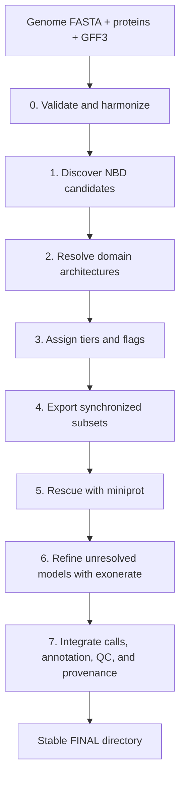

# FuNLR

**Fungal NLR Discovery, Reconstruction, and Comparative Genomics**

<div align="center">


</div>

**FuNLR** is a standalone, Python-first pipeline for discovering, reconstructing, classifying, annotating, and comparing fungal NOD-like receptor (NLR) systems. It combines curated profile-HMM searches, complete domain-architecture analysis, assembly-aware quality control, false-positive discrimination, targeted gene-model rescue, annotation reintegration, and standardized reporting in one reproducible workflow.

FuNLR is designed for the properties that make fungal NLRs both biologically compelling and computationally difficult: rapid gene-family turnover, repetitive sensor regions, modular output–NBD–sensor architectures, noncanonical domain arrangements, fragmented gene models, and receptor systems whose components may be encoded by neighboring genes rather than by one fused protein.

> **Development status:** The Python-orchestrated single-genome discovery, classification, rescue, annotation-integration, and reporting workflow is functional. It originated as an HPC-specific collection of shell, Python, and R scripts and has been reorganized as a portable Python application. The underlying workflow has been applied to a uniformly annotated 37-genome *Psilocybe* cohort. Comparative, evolutionary, expression, and mobile-genome modules listed under [Planned functionality](#planned-functionality) remain roadmap items unless explicitly identified as implemented in a release.

> **Release caution:** Commands involving public package indexes or container registries are marked as planned until the corresponding release artifact exists. Use a versioned tag or immutable digest rather than `latest` for reproducible analyses.

---

## Why fungal NLRs?

Fungal NLRs are modular intracellular immune-receptor proteins. A typical receptor contains:

1. an N-terminal **output domain** associated with signaling or regulated cell death;
2. a central nucleotide-binding and oligomerization domain (**NBD**), usually a **NACHT** or **NB-ARC** domain; and
3. a variable C-terminal **sensor region**, often composed of WD40, ankyrin, TPR, HEAT, Kelch, or related repeats.

Some literature refers to the N-terminal region as an *effector domain*. FuNLR uses **output domain** in general documentation to avoid confusion with pathogen-derived effectors.

Only a minority of fungal NLRs have experimentally established functions. Known examples participate in allorecognition, regulated cell death, and maintenance of fungal individuality, but most fungal NLR repertoires remain functionally unexplored. Their rapid turnover, genomic clustering, repeat exchange, modular domain reassortment, association with transposable elements, and occurrence in structurally dynamic genome regions make them powerful systems for studying how fungal immune recognition evolves.

They are also difficult to annotate reliably. Generic gene-prediction and protein-annotation workflows may:

- split long, repeat-rich NLRs into multiple gene models;
- collapse or truncate sensor-repeat arrays;
- miss divergent output domains;
- confuse housekeeping STAND ATPases with immune-associated NLRs;
- report false gene-family gains and losses caused by annotation quality;
- overlook partial receptors near scaffold boundaries; or
- miss biologically distributed receptor loci in which sensing, nucleotide binding, and output functions reside on separate neighboring proteins.

FuNLR aims to make these cases tractable without treating every NBD-containing protein as an NLR or every incomplete architecture as a biological gene loss.

---

## Design principles

FuNLR follows several software-design principles intended to make large bioinformatics workflows easier to run, audit, resume, and extend:

- **Standalone operation.** FuNLR accepts standard genome, proteome, and annotation files and does not require a particular upstream pipeline.
- **Python-first implementation.** Python handles orchestration, validation, parsing, classification, reporting, provenance, and state management. External tools are called through version-aware Python wrappers.
- **TSV-driven cohort execution.** One sample sheet can describe many fungal genomes without embedding thresholds or program logic in the table.
- **Stage-aware resumability.** Each stage writes structured completion metadata and can be resumed or selectively rerun.
- **Explicit failure policy.** Required resources fail clearly; optional evidence is skipped with a visible warning and recorded capability change.
- **Safe file management.** Intermediates are cleaned only after validated downstream handoff, never after a failed stage.
- **Stable final deliverables.** Detailed stage outputs remain under `results/`, while analysis-ready artifacts are gathered under `FINAL/`.
- **Complete provenance.** Commands, versions, checksums, profile-database builds, configuration, warnings, and output schemas are recorded.
- **Evidence preservation.** High-confidence calls, review candidates, rescue candidates, and rejected candidates remain available for audit.
- **No hosted service requirement.** FuNLR is intended as a local command-line application with portable outputs, containers, and static reports.

---

## Table of contents

1. [Current functionality](#current-functionality)
2. [Requirements](#requirements)
3. [Installation](#installation)
4. [Pipeline flow](#pipeline-flow)
5. [Supported input modes](#supported-input-modes)
6. [Quick start](#quick-start)
7. [TSV-driven batch input](#tsv-driven-batch-input)
8. [Command-line interface](#command-line-interface)
9. [Configuration](#configuration)
10. [Pipeline stages](#pipeline-stages)
11. [Candidate tiers and flags](#candidate-tiers-and-flags)
12. [Logging, provenance, and resumability](#logging-provenance-and-resumability)
13. [File management and storage](#file-management-and-storage)
14. [Quality-control review](#quality-control-review)
15. [Output directory structure](#output-directory-structure)
16. [Interpreting results](#interpreting-results)
17. [Profile databases](#profile-databases)
18. [Python architecture](#python-architecture)
19. [HPC and scheduler use](#hpc-and-scheduler-use)
20. [Troubleshooting and FAQ](#troubleshooting-and-faq)
21. [Planned functionality](#planned-functionality)
22. [Testing and reproducibility](#testing-and-reproducibility)
23. [References and citation](#references-and-citation)
24. [Changelog](#changelog)
25. [Contributing](#contributing)
26. [Developers](#developers)
27. [License](#license)
28. [Acknowledgements](#acknowledgements)

---

## Current functionality

### Multi-evidence candidate discovery

FuNLR combines:

- curated fungal NBD profile HMMs;
- Pfam domain calls;
- custom output-, sensor-, and amyloid-signaling-motif profiles;
- optional functional annotations from eggNOG-mapper or a generic annotation table;
- genome, GFF3, and protein-coordinate information; and
- scaffold-edge and repeat context when genomic inputs are available.

Functional descriptions provide supporting evidence but do not independently define a canonical NLR.

### Domain-aware architecture reconstruction

FuNLR identifies and orders:

- NACHT, NB-ARC, and related NBDs;
- N-terminal output domains;
- repeat-rich and non-repeat sensor-like domains;
- amyloid signaling motifs;
- integrated or decoy-like domains; and
- atypical or reversed domain arrangements.

Architectures are summarized in a standardized output–NBD–sensor representation while preserving all raw and resolved domain calls.

### Evidence-ranked classification

Candidates are classified using:

- NBD score, coverage, and aligned length;
- recognized fungal NLR architecture;
- protein length and domain order;
- scaffold-edge and local-repeat context;
- functional-description support;
- false-positive STAND ATPase signatures; and
- gene-model rescue evidence.

The complete candidate universe is retained for auditability, while a strict subset is exported for downstream repertoire analyses.

### Assembly-aware gene-model rescue

FuNLR prioritizes structurally suspicious candidates for protein-to-genome rescue:

1. **miniprot** performs first-pass protein-to-genome alignment;
2. unresolved or irregular models are escalated to **exonerate**; and
3. accepted rescue coordinates, model-quality evidence, and provenance are integrated into final outputs.

This is especially useful for long, repetitive NLRs near scaffold ends or in fragmented assemblies.

### Fragment and fusion assessment

FuNLR evaluates nearby NBD-only, sensor-only, and output-only gene models as possible fragments of one incorrectly annotated receptor. Candidate combinations are evaluated using genomic distance, strand, order, assembly context, and protein-to-genome realignment.

FuNLR keeps **technical fragmentation** conceptually separate from **biologically distributed NLR-like systems**, in which sensor, NBD, output, kinase, or signaling functions may genuinely reside on separate neighboring proteins. Expanded automated discovery of distributed systems is planned.

### Annotation reintegration

Final calls can be written back into:

- GFF3 transcript attributes;
- regenerated or synchronized protein FASTA files;
- functional annotation tables; and
- standardized TSV, BED, FASTA, GFF3, JSON, and manifest outputs.

Common annotation fields include NLR tier, NBD confidence, rescue priority, flags, ordered domains, and simplified architecture.

### Reproducible execution

FuNLR records:

- input checksums;
- software and database versions;
- HMM model provenance and checksums;
- the fully resolved configuration;
- external commands executed;
- stage-level runtime and completion metadata;
- warnings and skipped optional capabilities; and
- deterministic final manifests.

---

## Requirements

### Hardware

FuNLR does not require a GPU.

| Resource | Minimum | Recommended |
|---|---:|---:|
| CPU cores | 4 | 16+ |
| RAM | 8 GB | 32 GB+ |
| Free disk space | 20 GB per sample plus databases | 50 GB+ per sample for rescue-heavy runs |
| Temporary/scratch space | Recommended | Fast local or HPC scratch |

Runtime and disk usage depend on proteome size, Pfam size, candidate count, assembly fragmentation, rescue settings, retained intermediates, and cohort size.

### Software

The current workflow uses:

| Tool | Role |
|---|---|
| Python 3.11+ | Orchestration, validation, parsing, classification, reporting, and provenance |
| HMMER 3 | Profile-HMM searches, validation, and indexing |
| MAFFT | Alignment when rebuilding selected profile HMMs |
| samtools | FASTA indexing and sequence retrieval |
| seqkit | FASTA manipulation and validation |
| miniprot | First-pass protein-to-genome rescue |
| exonerate | Sensitive refinement of unresolved models |
| gffread | Annotation and protein-product regeneration |

Validated versions are recorded in each run manifest and should be pinned in release containers rather than treated as universal minimums in this README.

---

## Installation

FuNLR is under active development. Installation commands may change while packaging stabilizes.

### Development installation from GitHub

```bash
git clone https://github.com/iPsychonaut/FuNLR.git
cd FuNLR

python -m venv .venv
source .venv/bin/activate

python -m pip install --upgrade pip
python -m pip install -e .

funlr --help
funlr version
```

A source installation requires external executables to be available on `PATH` unless explicit executable paths are provided in the configuration.

### Planned Apptainer installation

Official OCI images are intended to be published through Quay.io and pulled directly with Apptainer:

```bash
apptainer pull funlr.sif \
  docker://quay.io/ipsychonaut/funlr:<VERSION>

apptainer exec funlr.sif funlr --help
```

Use a versioned tag or immutable digest rather than `latest` for published analyses.

### Planned Conda or Bioconda installation

```bash
mamba create -n funlr -c conda-forge -c bioconda funlr
conda activate funlr
funlr --help
```

Do not treat this command as functional until the package is published.

### Database setup

FuNLR requires a Pfam HMM database and a versioned FuNLR profile collection. Database helpers are available through the `funlr db` command group:

```bash
funlr db inspect --database /path/to/funlr_profiles
funlr db verify --database /path/to/funlr_profiles
funlr db build --config profile_build.yaml --output funlr_profiles/
```

Published profile bundles should include source metadata, citations, model checksums, build logs, and redistribution terms.

---

## Pipeline flow

At a glance, FuNLR moves a fully annotated genome through eight stages:

```text
Validate and harmonize
        → Discover candidates
        → Resolve domain architectures
        → Assign tiers and flags
        → Export synchronized subsets
        → Rescue with miniprot
        → Refine with exonerate
        → Integrate and report
```



The Python orchestrator normally executes all applicable stages. Individual stages can be resumed or rerun without replacing valid upstream results unless explicitly forced.

---

## Supported input modes

FuNLR infers the available analysis mode from the files supplied.

| Mode | Required inputs | Available functions |
|---|---|---|
| **Full annotation mode** | Genome FASTA, protein FASTA, GFF3, Pfam | Discovery, architecture, genomic context, rescue, annotation integration, and reporting |
| **Proteome mode** | Protein FASTA, Pfam | Candidate discovery and protein architecture analysis; no genomic-context or rescue stages |
| **Batch mode** | FuNLR sample TSV | Consistent execution across multiple genomes or proteomes |
| **Summary mode** | Existing FuNLR run directory | Regenerate summaries, manifests, and exports without rerunning searches |

### Required input consistency

For full annotation mode, FuNLR verifies that:

- genome sequence identifiers match GFF3 sequence identifiers;
- protein identifiers map to GFF3 transcript models;
- transcript and gene identifiers are unique;
- FASTA records do not contain duplicate identifiers;
- genomic coordinates are valid; and
- accepted rescue products remain synchronized with final annotations.

Use `funlr validate --write-normalized` to create synchronized working copies when normalization is needed. Original user inputs are not modified in place.

---

## Quick start

### Validate a full input set

```bash
funlr validate \
  --genome genome.fa \
  --proteins proteins.faa \
  --gff3 annotation.gff3 \
  --pfam /databases/Pfam-A.hmm
```

### Run the complete workflow

```bash
funlr run \
  --genome genome.fa \
  --proteins proteins.faa \
  --gff3 annotation.gff3 \
  --pfam /databases/Pfam-A.hmm \
  --temp_dir /scratch/funlr \
  --output_dir funlr_results \
  --cpu_threads 16 \
  --ram_gb 32
```

### Add optional annotation and repeat evidence

```bash
funlr run \
  --genome genome.fa \
  --masked_genome genome.masked.fa \
  --proteins proteins.faa \
  --gff3 annotation.gff3 \
  --eggnog proteins.emapper.annotations \
  --annotation_table annotation.tsv \
  --repeats repeats.gff3 \
  --pfam /databases/Pfam-A.hmm \
  --temp_dir /scratch/funlr \
  --output_dir funlr_results \
  --cpu_threads 16 \
  --ram_gb 32
```

### Run from a YAML configuration

```bash
funlr init-config > funlr.yaml
funlr run --config funlr.yaml
```

### Dry run

```bash
funlr run --config funlr.yaml --dry_run
```

A dry run validates inputs, databases, dependencies, output paths, stage eligibility, planned commands, and file-management actions without running the biological analyses.

### Resume

```bash
funlr run --config funlr.yaml --resume
```

### Limit or rerun stages

```bash
# Stop after tiering
funlr run --config funlr.yaml --max_stage 3

# Resume from miniprot rescue
funlr run --config funlr.yaml --start_stage 5

# Force only the tiering stage and invalidate its downstream stages
funlr run --config funlr.yaml --stage 3 --force_stage
```

---

## TSV-driven batch input

FuNLR supports a tab-separated sample sheet for reproducible cohort processing.

### Recommended header

```text
SPECIES_ID	SAMPLE_ID	ORGANISM_KINGDOM	ORGANISM_KARYOTE	PLOIDY	GENOME_PATH	MASKED_GENOME_PATH	PROTEINS_PATH	GFF3_PATH	EGGNOG_PATH	ANNOTATION_TABLE_PATH	REPEATS_PATH	PFAM_PATH	FUNLR_PROFILE	CUSTOM_HMMS
```

### Column descriptions

| Column | Required? | Description |
|---|---|---|
| `SPECIES_ID` | Yes | Species identifier, preferably `Genus_species` |
| `SAMPLE_ID` | Yes | Unique sample or strain identifier |
| `ORGANISM_KINGDOM` | Yes | Must be `Funga` for the current workflow |
| `ORGANISM_KARYOTE` | Recommended | Normally `eukaryote` |
| `PLOIDY` | Optional | Nuclear-state metadata; propagated to QC and comparative outputs |
| `GENOME_PATH` | Full mode | Genome FASTA |
| `MASKED_GENOME_PATH` | Optional | Repeat-masked genome FASTA |
| `PROTEINS_PATH` | Yes | Protein FASTA |
| `GFF3_PATH` | Full mode | Structural annotation GFF3 |
| `EGGNOG_PATH` | Optional | eggNOG-mapper annotation file |
| `ANNOTATION_TABLE_PATH` | Optional | Generic functional annotation table |
| `REPEATS_PATH` | Optional | Repeat or transposable-element GFF3/BED |
| `PFAM_PATH` | Yes unless supplied globally | Pfam HMM database |
| `FUNLR_PROFILE` | Optional | Named FuNLR profile bundle; default `fungi_general` or `auto` |
| `CUSTOM_HMMS` | Optional | Comma-separated project-specific HMM files |

### Example

```text
SPECIES_ID	SAMPLE_ID	ORGANISM_KINGDOM	ORGANISM_KARYOTE	PLOIDY	GENOME_PATH	MASKED_GENOME_PATH	PROTEINS_PATH	GFF3_PATH	EGGNOG_PATH	ANNOTATION_TABLE_PATH	REPEATS_PATH	PFAM_PATH	FUNLR_PROFILE	CUSTOM_HMMS
Psilocybe_cubensis	Pc_BM	Funga	eukaryote	2	data/Pc_BM.genome.fa	data/Pc_BM.masked.fa	data/Pc_BM.proteins.faa	data/Pc_BM.gff3	data/Pc_BM.emapper.annotations		data/Pc_BM.repeats.gff3	/databases/Pfam-A.hmm	agaricomycetes	
```

### Batch execution

```bash
funlr batch \
  --input_tsv funlr_samples.tsv \
  --config funlr.yaml \
  --temp_dir /scratch/FuNLR \
  --output_dir cohort_results \
  --cpu_threads 16 \
  --ram_gb 32 \
  --resume
```

### TSV rules

- Use tabs between columns.
- Leave unavailable optional values blank; `None`, `NA`, and `null` are accepted case-insensitively.
- Paths may be absolute or relative to the TSV directory.
- `SAMPLE_ID` values must be unique.
- FuNLR does not reorder custom HMM files or evidence sources.
- Sample metadata are propagated to manifests and reports.
- Detailed thresholds belong in YAML, not the TSV.

---

## Command-line interface

```text
funlr COMMAND [OPTIONS]
```

### Commands

| Command | Description |
|---|---|
| `funlr run` | Execute the single-sample discovery and reconstruction workflow |
| `funlr batch` | Process a FuNLR sample TSV locally or through a scheduler profile |
| `funlr validate` | Validate inputs, identifiers, databases, dependencies, and write normalized copies |
| `funlr init-config` | Write a documented starter configuration |
| `funlr db build` | Build, normalize, deduplicate, validate, and press FuNLR HMM libraries |
| `funlr db inspect` | Report profile counts, names, checksums, categories, and source provenance |
| `funlr db verify` | Verify checksums, HMMER format, manifest consistency, and pressed indexes |
| `funlr summarize` | Regenerate summaries and QC tables from an existing run |
| `funlr export` | Export selected tiers as FASTA, TSV, BED, GFF3, or JSON |
| `funlr annotate` | Add FuNLR fields to GFF3 and synchronized annotation products |
| `funlr report` | Regenerate text or static report products without rerunning searches |
| `funlr clean` | Safely remove selected intermediates after validation |
| `funlr version` | Report FuNLR, Python, database, and dependency versions |

### Common options

| Flag | Short | Default | Description |
|---|---|---:|---|
| `--input_tsv` | `-tsv` | — | FuNLR sample sheet for batch execution |
| `--temp_dir` | `-tmp` | required | Temporary working or scratch directory |
| `--output_dir` | `-o` | required | Final output root |
| `--cpu_threads` | `-t` | `1` | CPU threads available to the workflow |
| `--ram_gb` | `-r` | `8` | RAM available in GB |
| `--config` | | — | YAML configuration file |
| `--dry_run` | | `False` | Validate and report planned actions without executing |
| `--resume` | | `False` | Resume from valid stage-completion records |
| `--keep_intermediates` | | `False` | Retain cleanup-eligible intermediates |
| `--start_stage` | | `0` | Earliest stage to consider |
| `--max_stage` | | `7` | Final stage to run |
| `--stage` | | — | Run one selected stage |
| `--force_stage` | | `False` | Rerun a stage and invalidate downstream state |

Hyphenated aliases such as `--input-tsv` may also be supported, but the underscore forms are the documented ecosystem-neutral interface.

### Environment variables

| Variable | Description |
|---|---|
| `FUNLR_DRY_RUN=1` | Enable dry-run mode |
| `FUNLR_KEEP_INTERMEDIATES=1` | Retain cleanup-eligible intermediates |
| `FUNLR_DB_DIR=/path/to/profiles` | Default FuNLR profile bundle directory |
| `FUNLR_CONTAINER_CACHE=/path/to/cache` | Optional OCI/Apptainer cache |
| `PFAM_DB=/path/to/Pfam-A.hmm` | Default Pfam HMM database |
| `TMPDIR=/path/to/scratch` | Temporary directory used by external tools when supported |

---

## Configuration

FuNLR uses a three-level configuration hierarchy:

1. built-in defaults;
2. user YAML configuration; and
3. command-line overrides, which have highest priority.

Every run writes the fully resolved configuration to `FINAL/provenance/resolved_config.yaml`.

### Example `funlr.yaml`

```yaml
project:
  name: example_fungus

inputs:
  genome: genome.fa
  masked_genome: genome.masked.fa
  proteins: proteins.faa
  gff3: annotation.gff3
  eggnog: proteins.emapper.annotations
  annotation_table: null
  repeats: repeats.gff3

profiles:
  bundle: fungi_general
  pfam: /databases/Pfam-A.hmm
  nbd: null
  sensor: null
  output: null
  asm: null
  custom: []

thresholds:
  strict_nbd_i_evalue: 1.0e-5
  strict_nbd_min_alignment: 180
  relaxed_nbd_i_evalue: 1.0e-3
  relaxed_nbd_min_alignment: 120
  domain_i_evalue: 1.0e-3
  domain_min_alignment: 20

context:
  scaffold_end_bp: 10000
  repeat_proximity_bp: 10000
  repeat_proximity_neighbors: 10
  minimum_rescue_flank_bp: 5000

classification:
  lrr_policy: preserve_as_atypical
  exclude_housekeeping_stand_from_strict: true
  preserve_all_candidates: true

rescue:
  enabled: true
  use_miniprot: true
  use_exonerate: true
  include_tier3: false
  exonerate_min_score: 150
  exonerate_min_percent: 70
  exonerate_max_intron: 5000

execution:
  temp_dir: /scratch/funlr
  output_dir: funlr_results
  cpu_threads: 16
  ram_gb: 32
  resume: true
  keep_intermediates: false

outputs:
  integrate_gff3: true
  regenerate_proteins: true
  write_bed: true
  write_json: true
  write_static_html: false
```

### Profiles

Named profiles control lineage-sensitive HMM collections and heuristics without changing the core workflow. Planned or example profiles include:

- `fungi_general`
- `ascomycota`
- `basidiomycota`
- `agaricomycetes`
- custom user profiles

A profile may alter model composition and recommended thresholds, but all resolved values and model checksums are recorded in the run provenance.

---

## Pipeline stages

### Stage 0: Validate and harmonize inputs

**Purpose:** Index the genome, standardize identifiers, reconcile GFF3 and FASTA records, and merge optional annotations into one master table.

**Primary behavior:**

- validates FASTA and GFF3 syntax;
- indexes genome sequences;
- detects duplicate identifiers;
- maps genes, transcripts, and proteins;
- records protein and scaffold lengths;
- checks coordinate consistency;
- parses optional eggNOG and generic annotations; and
- writes normalized working copies without modifying user inputs.

**Primary outputs:**

- `master_table.tsv`
- `contig_lengths.tsv`
- `protein_lengths.tsv`
- `id_coordinates.tsv`
- `proteins.clean.faa`
- `input_validation.tsv`
- `input_checksums.tsv`

### Stage 1: Discover candidate NBD proteins

**Purpose:** Scan the full proteome against curated fungal NBD profiles and create a multi-evidence candidate universe.

**Primary behavior:**

- runs HMMER against NACHT, NB-ARC, and related NBD models;
- applies strict and relaxed score/coverage thresholds;
- runs a supplementary Pfam NBD search;
- uses functional annotations as supporting evidence;
- records every supporting discovery route; and
- exports candidate proteins for full architecture analysis.

**Primary outputs:**

- `nbd_hits.all.tsv`
- `nbd_hits.strict.tsv`
- `nbd_hits.relaxed.tsv`
- `candidate_evidence.tsv`
- `candidate_ids.txt`
- `candidate_proteins.faa`

### Stage 2: Resolve complete domain architectures

**Purpose:** Scan candidate proteins against Pfam and FuNLR profile collections and reconstruct ordered domain architectures.

**Primary behavior:**

- identifies NBD, output, sensor, repeat, integrated, and ASM features;
- resolves overlapping HMM hits using versioned rules;
- retains both raw and grouped domain names;
- records domain order and orientation;
- flags uncertain boundaries and atypical architectures; and
- preserves LRR-containing and other unusual candidates for review rather than silently discarding them.

**Primary outputs:**

- `domain_hits.all.tsv`
- `domain_hits.resolved.tsv`
- `architecture_summary.tsv`
- `architecture_flags.tsv`

### Stage 3: Assign tiers, flags, and rescue priorities

**Purpose:** Combine sequence, architecture, annotation, and genomic-context evidence into an auditable classification.

**Primary outputs:**

- `tiered_candidates.tsv`
- `candidate_flags.tsv`
- `rescue_priority.tsv`
- `nlr_candidates.bed`
- tier-specific BED tracks
- `tier_summary.tsv`
- `flag_summary.tsv`

### Stage 4: Export synchronized candidate subsets

**Purpose:** Create synchronized FASTA, TSV, and BED subsets for review, rescue, and downstream analysis.

**Primary outputs:**

- `tier1A_high_confidence.faa`
- `tier1B_needs_review.faa`
- `tier2A_high_priority_rescue.faa`
- `tier2B_rescue_candidate.faa`
- `tier3_architectural_variant.faa`
- `tier4A_repeat_only_no_nbd.faa`
- `tier4B_likely_stand_housekeeping.faa`
- `tier4C_no_nbd_no_repeat_low_signal.faa`
- `all_tiered_candidates.faa`

### Stage 5: Rescue with miniprot

**Purpose:** Perform first-pass protein-to-genome rescue of incomplete or suspicious candidates.

**Primary behavior:**

- selects Tier 1B, Tier 2A, Tier 2B, and optionally Tier 3 queries;
- deduplicates rescue sequences;
- runs miniprot against the genome;
- summarizes locus and alignment quality; and
- identifies unresolved or structurally irregular cases for escalation.

**Primary outputs:**

- `miniprot.gff3`
- `miniprot_summary.tsv`
- `miniprot_qc.tsv`
- `exonerate_refine_ids.txt`

### Stage 6: Refine unresolved candidates with exonerate

**Purpose:** Apply sensitive protein-to-genome alignment to candidates unresolved or poorly modeled after miniprot.

**Primary behavior:**

- runs exonerate in `protein2genome` mode;
- evaluates score, percent identity, genomic span, intron length, and CDS structure;
- tests nearby fragment combinations when supported by context;
- preserves competing models when evidence is ambiguous; and
- distinguishes accepted rescue, unresolved, and review-required outcomes.

**Primary outputs:**

- `exonerate_merged.gff3`
- `exonerate_summary.tsv`
- `fragment_fusion_candidates.tsv`
- `rescue_model_decisions.tsv`

### Stage 7: Integrate final calls, annotation, QC, and provenance

**Purpose:** Merge original, miniprot, exonerate, architecture, classification, and provenance evidence into final analysis products.

**Primary outputs:**

- `funlr.calls.tsv`
- `funlr.strict.tsv`
- `funlr.review.tsv`
- `funlr.rejected.tsv`
- `funlr.rescue_models.gff3`
- `final.annotation.funlr.gff3`
- `final.annotation.funlr.proteins.fa`
- `final.annotation.funlr.annotations.tsv`
- `funlr.qc_summary.tsv`
- `funlr.tier_summary.tsv`
- `FINAL_manifest.tsv`
- `FINAL_summary.txt`

---

## Candidate tiers and flags

The default tier names preserve the current evidence-ranking scheme. Exact rules are versioned in the resolved configuration and classification-rule manifest.

| Tier | Interpretation | Typical evidence |
|---|---|---|
| **Tier 1A** | High-confidence canonical NLR | Strong NBD plus recognized fungal sensor architecture, acceptable organization, and no major false-positive or structural flags |
| **Tier 1B** | Strong candidate requiring review | Strong NLR-like architecture with scaffold-edge, protein-length, domain-order, or model-quality concern |
| **Tier 2A** | High-priority rescue | NBD-positive incomplete architecture with strong evidence that a better model may be recoverable |
| **Tier 2B** | Rescue candidate | Partial or atypical NBD-positive candidate with weaker or more ambiguous rescue evidence |
| **Tier 3** | Architectural variant | NBD-positive protein with noncanonical domains or no recognized repeat sensor, retained for biological review |
| **Tier 4A** | Repeat-only candidate | Sensor-like repeat architecture without adequate NBD evidence; may represent a fragment, neighboring component, or unrelated repeat protein |
| **Tier 4B** | Likely non-NLR STAND protein | NBD-like evidence accompanied by strong housekeeping or false-positive signatures |
| **Tier 4C** | Low-signal candidate | Insufficient NBD and sensor evidence for an NLR interpretation |

### Common flags

| Flag | Meaning |
|---|---|
| `CONTIG_END` | Candidate lies within the configured distance of a scaffold end |
| `SUBTELOMERIC` | Candidate lies in a supported subtelomeric region |
| `SHORT_PROTEIN` | Protein is shorter than the configured review threshold |
| `VERY_LONG_PROTEIN` | Protein is unusually long and may contain a fusion or erroneous model |
| `NBD_ONLY` | Recognized NBD with no other resolved domains |
| `REPEAT_NEARBY` | Repeat-containing gene or feature occurs within the configured neighborhood |
| `RESCUE_POSSIBLE` | Sufficient genomic flank exists for rescue |
| `RESCUE_NO_FLANK` | Candidate may be incomplete but lacks adequate sequence context |
| `NON_NLR_ANNOT` | Annotation keywords, GO terms, or domains support a housekeeping interpretation |
| `FP_DOMAIN_PRESENT` | Domain combination resembles a non-NLR ATPase or other false-positive class |
| `ORDER_ATYPICAL` | Domain order differs from the default output–NBD–sensor pattern |
| `INTEGRATED_DOMAIN` | Candidate contains an additional integrated or decoy-like domain |
| `LRR_PRESENT` | LRR evidence is preserved as an atypical-context flag; default strict-set handling is profile-dependent |
| `MODEL_RESCUED` | A revised protein-to-genome model passed rescue criteria |
| `FUSION_CANDIDATE` | Nearby models may be fragments of one biological gene |
| `DISTRIBUTED_LOCUS_CANDIDATE` | Nearby genes may form a biologically distributed receptor system |

Flags are evidence, not diagnoses. They remain visible in final outputs and should not be silently discarded before comparative or manual review.

---

## Logging, provenance, and resumability

### Per-sample and per-stage logs

Each sample receives dedicated logs:

```text
logs/
├── <sample>.0_validate.log
├── <sample>.1_discover.log
├── <sample>.2_architecture.log
├── <sample>.3_tier.log
├── <sample>.4_export.log
├── <sample>.5_miniprot.log
├── <sample>.6_exonerate.log
└── <sample>.7_finalize.log
```

A session log records startup information, the resolved configuration, stage state transitions, warnings, and command summaries.

### Structured completion records

A stage is considered complete only after required outputs are present, non-empty where appropriate, validated, and recorded in a structured state file.

Example:

```json
{
  "stage": "3_tier",
  "status": "PASS",
  "started_at": "2026-07-21T14:00:00-04:00",
  "completed_at": "2026-07-21T14:06:13-04:00",
  "input_fingerprint": "sha256:...",
  "config_fingerprint": "sha256:...",
  "profile_fingerprint": "sha256:...",
  "outputs": [
    {
      "path": "results/3_tier/tiered_candidates.tsv",
      "sha256": "...",
      "size_bytes": 123456
    }
  ]
}
```

### Resume validation

Before skipping a stage during `--resume`, FuNLR verifies:

1. the completion record exists;
2. the stage status is `PASS`;
3. required outputs still exist and validate;
4. input fingerprints still match;
5. stage-relevant configuration values still match; and
6. profile-database fingerprints still match.

A changed NBD threshold invalidates discovery and downstream stages. A change limited to final reporting can preserve biological search results.

### Provenance capture

Every external command is recorded with:

- exact command line;
- executable path;
- reported software version;
- working directory;
- start and end times;
- return code;
- standard-output and standard-error log paths;
- input and output files; and
- container URI and digest when applicable.

---

## File management and storage

FuNLR preserves final deliverables and audit-relevant evidence while permitting validated cleanup of large intermediates.

### Safety guarantees

- Intermediates are never removed after a failed stage.
- A downstream replacement must be present and validated before cleanup.
- Files required for resume checks are retained.
- Rejected and rescue candidates remain auditable.
- Every deletion or compression is logged with the space freed.
- `--dry_run` reports intended actions without modifying files.
- `--keep_intermediates` disables cleanup.

### Typical cleanup targets

- unfiltered raw HMMER text after parsed tables validate;
- duplicate tier FASTAs after final manifest creation;
- temporary extracted genomic windows;
- per-query exonerate scratch files after merged-output validation;
- transient alignment indexes; and
- redundant compressed/uncompressed copies created only for handoff.

Use:

```bash
funlr clean --run_dir funlr_results --dry_run
funlr clean --run_dir funlr_results
```

The `FINAL/` directory and provenance records are never removed by the default cleanup policy.

---

## Quality-control review

### What should I inspect first?

Start with:

```text
FINAL/FINAL_summary.txt
FINAL/nlr/funlr.calls.tsv
FINAL/nlr/funlr.strict.tsv
FINAL/nlr/funlr.review.tsv
FINAL/qc/funlr.qc_summary.tsv
FINAL/qc/funlr.tier_summary.tsv
FINAL/annotation/final.annotation.funlr.gff3
FINAL/provenance/funlr.provenance.json
```

### `FINAL_summary.txt` should answer

- Did the run complete successfully?
- Which FuNLR, profile-database, Pfam, and external-tool versions were used?
- How many candidates were found by each discovery route?
- How many candidates fell into each tier?
- How many were flagged as likely housekeeping STAND proteins?
- How many models were evaluated, rescued, rejected, or retained for review?
- Were major input-consistency or assembly-fragmentation warnings present?
- Which strict file should be used for downstream repertoire analysis?
- Which candidates require manual review?

### Recommended QC summaries

| File | Purpose |
|---|---|
| `funlr.qc_summary.tsv` | Overall input, discovery, architecture, rescue, and output metrics |
| `funlr.tier_summary.tsv` | Candidate counts by tier |
| `funlr.flag_summary.tsv` | Counts of review and context flags |
| `funlr.rescue_summary.tsv` | miniprot and exonerate outcomes |
| `funlr.profile_summary.tsv` | Profile library versions, categories, and model counts |
| `funlr.input_quality_context.tsv` | Assembly and annotation context relevant to interpreting apparent absences |

---

## Output directory structure

FuNLR writes detailed intermediate outputs under `results/` and gathers stable deliverables into `FINAL/`.

```text
<sample>/
├── logs/
│   ├── <sample>.0_validate.log
│   ├── <sample>.1_discover.log
│   ├── <sample>.2_architecture.log
│   ├── <sample>.3_tier.log
│   ├── <sample>.4_export.log
│   ├── <sample>.5_miniprot.log
│   ├── <sample>.6_exonerate.log
│   └── <sample>.7_finalize.log
│
├── results/
│   ├── 0_validate/
│   ├── 1_discover/
│   ├── 2_architecture/
│   ├── 3_tier/
│   ├── 4_export/
│   ├── 5_miniprot/
│   ├── 6_exonerate/
│   └── 7_final/
│
├── state/
│   ├── 0_validate.done.json
│   ├── 1_discover.done.json
│   ├── 2_architecture.done.json
│   ├── 3_tier.done.json
│   ├── 4_export.done.json
│   ├── 5_miniprot.done.json
│   ├── 6_exonerate.done.json
│   └── 7_finalize.done.json
│
└── FINAL/
    ├── annotation/
    │   ├── final.annotation.funlr.gff3
    │   ├── final.annotation.funlr.proteins.fa
    │   └── final.annotation.funlr.annotations.tsv
    │
    ├── nlr/
    │   ├── funlr.calls.tsv
    │   ├── funlr.strict.tsv
    │   ├── funlr.review.tsv
    │   ├── funlr.rejected.tsv
    │   ├── funlr.architectures.tsv
    │   └── funlr.rescue_models.gff3
    │
    ├── evidence/
    │   ├── funlr.nbd_hits.tsv
    │   ├── funlr.domain_hits.tsv
    │   ├── funlr.candidate_evidence.tsv
    │   └── funlr.candidate_issues.tsv
    │
    ├── qc/
    │   ├── funlr.qc_summary.tsv
    │   ├── funlr.tier_summary.tsv
    │   ├── funlr.flag_summary.tsv
    │   ├── funlr.rescue_summary.tsv
    │   ├── funlr.input_quality_context.tsv
    │   └── funlr.profile_summary.tsv
    │
    ├── provenance/
    │   ├── funlr.provenance.json
    │   ├── resolved_config.yaml
    │   ├── input_checksums.tsv
    │   ├── software_versions.tsv
    │   ├── profile_manifest.tsv
    │   └── commands.jsonl
    │
    ├── FINAL_manifest.tsv
    ├── FINAL_summary.txt
    └── README.txt
```

### Key final deliverables

| File | Description |
|---|---|
| `funlr.calls.tsv` | Complete evidence table for all retained candidates |
| `funlr.strict.tsv` | High-confidence subset for most repertoire comparisons |
| `funlr.review.tsv` | Candidates requiring annotation or biological review |
| `funlr.rejected.tsv` | Auditable low-signal and likely false-positive candidates |
| `funlr.architectures.tsv` | Ordered and simplified architecture calls |
| `final.annotation.funlr.gff3` | Input annotation with FuNLR attributes and accepted rescue models |
| `final.annotation.funlr.proteins.fa` | Synchronized protein products after accepted rescue |
| `funlr.rescue_models.gff3` | Accepted and alternative rescue models |
| `FINAL_manifest.tsv` | Stable machine-readable map of final artifacts |
| `funlr.provenance.json` | Complete run provenance and state summary |

### Important columns in `funlr.calls.tsv`

| Column | Meaning |
|---|---|
| `gene_id`, `transcript_id`, `protein_id` | Synchronized identifiers |
| `seqid`, `start`, `end`, `strand` | Genomic location |
| `protein_length` | Protein length in amino acids |
| `tier` | FuNLR confidence tier |
| `nlr_confidence` | Overall confidence score or class |
| `nbd_family` | Best-supported NBD family |
| `nbd_i_evalue`, `nbd_coverage` | NBD evidence |
| `domains_ordered` | Ordered resolved domain calls |
| `architecture_simple` | Simplified output–NBD–sensor architecture |
| `output_domains`, `sensor_domains`, `asm_motifs` | Grouped architecture components |
| `flags` | Semicolon-delimited evidence and review flags |
| `rescue_priority` | Rescue ranking |
| `original_model_status` | Status of the input model |
| `rescue_method` | `none`, `miniprot`, `exonerate`, or combined review |
| `rescued_coordinates` | Accepted rescue coordinates when applicable |
| `annotation_description`, `go_terms`, `kegg_ko` | Optional functional evidence |
| `nearest_repeat_distance` | Distance to supported repeat evidence |
| `scaffold_end_distance` | Distance to nearest scaffold end |

The schema is versioned. Downstream software should check the manifest’s schema version rather than assume columns remain unchanged between releases.

---

## Interpreting results

### Use the strict set for most repertoire comparisons

`funlr.strict.tsv` is intended for count matrices, repertoire summaries, orthology staging, and other analyses in which false positives or annotation fragmentation could distort biological conclusions.

### Retain the complete set for annotation review

Tier 2, Tier 3, and selected Tier 4 candidates can represent:

- genuine divergent NLRs;
- scaffold-edge truncations;
- incorrectly split models;
- biologically distributed receptor components;
- recent pseudogenization; or
- non-NLR STAND-family proteins.

Discarding these candidates before review can hide biologically interesting variation.

### NLR prediction is not functional validation

FuNLR identifies receptor-like proteins and loci. It does not prove ligand recognition, immune signaling, allorecognition, regulated cell death, or any other biological function.

### Apparent absence is not automatically biological absence

Low assembly contiguity, scaffold-edge exposure, truncated proteins, annotation incompleteness, or profile underrepresentation can create false absences. FuNLR reports these factors separately from candidate-level confidence.

### Gene-tree discordance requires multiple hypotheses

A discordant NLR tree is not, by itself, evidence of horizontal transfer. Candidate transfer must be evaluated against:

- introgression;
- incomplete lineage sorting;
- long-term balancing selection;
- gene conversion;
- paralogy and hidden duplication;
- annotation error; and
- convergent domain assembly.

### Fragmented and distributed systems are different

A split annotation model should be reconstructed into one gene only when sequence and genomic evidence support that interpretation. A biologically distributed locus may instead contain separate sensor, NBD, kinase, output, or signaling genes whose linkage is itself meaningful.

---

## Profile databases

FuNLR can use versioned profile bundles or build them locally from permitted source materials.

The database builder:

1. normalizes HMMER format and line endings;
2. validates required metadata;
3. removes exact duplicate models using checksums;
4. resolves model-name collisions deterministically;
5. records source, category, build method, and citation metadata;
6. validates libraries with `hmmstat`; and
7. indexes final databases with `hmmpress`.

The standard database set separates:

- NBD models;
- sensor models;
- N-terminal output models;
- amyloid signaling motif models; and
- a combined exploratory library.

Each release should include a model-level manifest so that every profile can be traced to its source and build procedure.

### Profile bundle manifest

Recommended fields include:

```text
profile_id	profile_name	category	source_resource	source_version	build_method	sequence_count	sha256	citation	license_notes
```

### External licensing

The FuNLR code license does not automatically cover Pfam, third-party profile HMMs, source sequences, or other databases. Distributed profile bundles must preserve the original redistribution, attribution, and citation requirements.

---

## Python architecture

FuNLR is designed as a Python application rather than a scheduler-specific script collection.

```text
FuNLR/
├── pyproject.toml
├── README.md
├── LICENSE
├── CONTRIBUTING.md
├── CITATION.cff
├── src/
│   └── funlr/
│       ├── __init__.py
│       ├── cli.py
│       ├── config.py
│       ├── models.py
│       ├── validate.py
│       ├── harmonize.py
│       ├── discover.py
│       ├── architecture.py
│       ├── classify.py
│       ├── export.py
│       ├── annotate.py
│       ├── summarize.py
│       ├── core/
│       │   ├── command_runner.py
│       │   ├── stage_runner.py
│       │   ├── state.py
│       │   ├── logging.py
│       │   ├── provenance.py
│       │   ├── file_manager.py
│       │   └── manifest.py
│       ├── databases/
│       │   ├── build.py
│       │   ├── inspect.py
│       │   ├── verify.py
│       │   └── provenance.py
│       ├── rescue/
│       │   ├── miniprot.py
│       │   ├── exonerate.py
│       │   └── fragments.py
│       ├── parsers/
│       │   ├── fasta.py
│       │   ├── gff.py
│       │   ├── hmmer.py
│       │   ├── eggnog.py
│       │   └── domains.py
│       ├── reporting/
│       │   ├── summaries.py
│       │   ├── static_html.py
│       │   └── finalizer.py
│       └── workflow/
│           ├── orchestrator.py
│           ├── stages.py
│           └── capability.py
├── profiles/
│   ├── local/
│   └── slurm/
├── containers/
│   ├── Containerfile
│   └── apptainer.def
├── configs/
│   └── example.yaml
├── docs/
└── tests/
    ├── unit/
    ├── integration/
    └── fixtures/
```

Python performs:

- configuration parsing and validation;
- workflow orchestration and state management;
- input normalization;
- HMMER output parsing;
- architecture inference;
- confidence scoring and tier assignment;
- rescue prioritization;
- external command construction and monitoring;
- tabular integration;
- safe file management;
- provenance capture; and
- report generation.

External tools remain responsible for specialized search and alignment algorithms. FuNLR calls them through version-aware Python wrappers and does not embed cluster module commands in the core application.

---

## HPC and scheduler use

FuNLR’s biological workflow is scheduler-agnostic. Local workstations, interactive HPC jobs, and batch systems invoke the same Python CLI.

### Local cohort execution

```bash
funlr batch \
  --input_tsv funlr_samples.tsv \
  --config funlr.yaml \
  --output_dir cohort_results \
  --jobs 4
```

### Write scheduler jobs

Optional profiles can render scheduler scripts without mixing scheduler syntax into the core pipeline:

```bash
funlr batch \
  --input_tsv funlr_samples.tsv \
  --config funlr.yaml \
  --profile slurm \
  --write_jobs slurm_jobs/
```

Direct job submission should be documented only for schedulers on which it has been tested. Generated job files should remain readable and independently executable.

---

## Troubleshooting and FAQ

### The pipeline stopped partway through. Can I resume it?

Yes. Run again with `--resume`. FuNLR checks structured completion records, output validation, input fingerprints, configuration fingerprints, and profile fingerprints before skipping a stage.

### Why did FuNLR rerun an earlier stage?

One or more stage-relevant inputs, thresholds, profiles, or outputs changed. Check the session log and state record for the invalidation reason.

### Why was an optional evidence source skipped?

Optional files such as eggNOG annotations or repeat tracks may be absent. FuNLR records the skipped capability and continues when the remaining analysis is valid. Required resources such as the protein FASTA and NBD profiles remain fatal.

### Why are some NBD-containing proteins classified as Tier 4B?

NBD-like domains also occur in housekeeping STAND ATPases and other proteins. FuNLR combines architecture, annotation, domain, and context evidence rather than classifying every NBD hit as an immune receptor.

### Why are LRR-containing proteins not automatically accepted as canonical fungal NLRs?

LRR-containing architectures are uncommon in the best-characterized fungal NLR sets and can overlap with other protein classes. FuNLR preserves them as atypical candidates and applies profile-specific strict-set rules rather than discarding them entirely.

### Why did a candidate near a scaffold end receive rescue priority?

Scaffold boundaries can truncate long NLR models. Rescue priority indicates that additional genomic alignment may clarify the model; it does not guarantee that a complete receptor exists.

### Why did miniprot not rescue every candidate?

The query may be too divergent, the assembly may lack sufficient sequence, the locus may be fragmented, or the original candidate may not represent one complete gene. FuNLR escalates selected unresolved cases to exonerate and preserves ambiguous outcomes for review.

### Can I run FuNLR with only a proteome?

Yes. Proteome mode supports discovery and architecture analysis, but genomic context, scaffold-edge assessment, rescue, and annotation reintegration are unavailable.

### The Pfam scan is slow or uses too much memory.

Confirm the database is pressed, reduce concurrent samples, use local scratch, and avoid running multiple memory-heavy Pfam scans on the same node. The provenance log records the command and resource context.

### Can FuNLR prove horizontal transfer?

No. FuNLR may eventually rank candidate transfer evidence, but horizontal transfer requires testing against introgression, incomplete lineage sorting, balancing selection, gene conversion, hidden paralogy, and annotation error.

### Does FuNLR modify my original annotation files?

No. Normalized inputs and NLR-enhanced annotations are written to the FuNLR output directory. Original user files are not edited in place.

### Is there a graphical interface?

The core interface is the command line. A terminal progress interface and static local HTML report are planned, but neither is required for reproducible execution.

---

## Planned functionality

The following capabilities are planned extensions. Their presence here does not imply that they are complete in the current release.

### Near-term software and reporting improvements

- Complete public Python packaging and semantic versioning.
- Publish versioned OCI images that can be pulled with Apptainer.
- Add Conda/Bioconda packaging.
- Add a small automated test dataset and `funlr validate --self-test`.
- Add a static, self-contained local HTML report.
- Add a Textual terminal interface showing logs, sample-by-stage progress, settings, CPU/RAM use, and `PENDING`, `RUNNING`, `PASS`, `FAIL`, `SKIP`, and `REVIEW` states.
- Add runtime and storage estimates during preflight validation.
- Expand taxonomic profile bundles for underrepresented fungal lineages.

### FuNLR-Resolve: distributed and broken-up NLR systems

- Distinguish annotation fragmentation from genuine multi-protein receptor loci.
- Search for linked sensor-only, NBD-only, kinase, output, executor, and amyloid-signaling genes.
- Model locus architectures similar to the distributed NLR-like organization reported at the *Coprinopsis cinerea somA* locus.
- Use conserved synteny and cross-species recurrence to support biological modularization.
- Add long-read, transcript, and splice-junction evidence for difficult loci.

### FuNLR-Compare: NBD-centered comparative genomics

- Construct NBD-only sequence sets linked back to full-length proteins and architectures.
- Infer orthogroups and gene families from conserved NBDs rather than highly variable full-length proteins.
- Generate copy-number, presence–absence, and architecture matrices.
- Compare NBD phylogeny with output- and sensor-domain histories.
- Support species-tree-aware duplication and loss analysis.
- Export candidate sets for MAFFT, IQ-TREE, OrthoFinder, and related tools.

### FuNLR-Switch: modular architecture evolution

- Detect recurrent replacement of output or sensor modules within an NBD lineage.
- Identify domain fusion, fission, insertion, deletion, and orientation changes.
- Quantify architecture entropy and modularity by gene family.
- Detect repeat exchange and candidate gene conversion among sensor regions.
- Test whether particular NBD lineages act as stable signaling chassis for rapidly changing sensors or outputs.

### FuNLR-Context: genomic-neighborhood analysis

- Measure distance to transposable elements, repeats, telomeres, centromeres, and structural-variation breakpoints.
- Test enrichment within or near Starships and Starship-like cargo-mobilizing elements.
- Test NLR proximity to BGCs, gene-cluster families, standalone executioners, and other defense-associated genes.
- Compare observed proximity with gene-density-, scaffold-, repeat-, and chromosome-matched null models.
- Track conservation and disruption of NLR neighborhoods across pangenomes.

### FuNLR-Evolve: evolutionary-process inference

- Detect candidate whole-gene, locus-level, and domain-level horizontal transfer.
- Compare transfer hypotheses with introgression, incomplete lineage sorting, balancing selection, and gene conversion.
- Quantify gene-family turnover, dN/dS, lineage-specific expansion, and trans-species polymorphism.
- Identify incongruent domain trees within the same receptor.
- Integrate synteny, sequence composition, phylogenetic support, and mobile-element context into ranked evidence.

### FuNLR-Deploy: developmental and challenge expression

- Import RNA-seq expression matrices and sample metadata.
- Summarize tissue-, stage-, and challenge-associated deployment.
- Test whether receptor transcripts, neighboring output genes, and nearby BGCs are co-regulated.
- Separate receptor abundance from candidate activation or downstream response.
- Support WGCNA and other co-expression-network overlays without making them core dependencies.
- Export expression-aware candidate rankings for functional experiments.

### Structural and functional extensions

- Integrate AlphaFold or ColabFold outputs as optional evidence.
- Refine uncertain domain boundaries with structure-aware evidence.
- Map hypervariable residues onto predicted sensor surfaces.
- Classify uncharacterized output domains and candidate downstream cell-death modules.
- Develop conservative machine-learning classifiers only after sufficiently curated training data exist.

### Structural variation and somatic evolution

- Compare clonal or population isolates using long-read assemblies.
- Detect NLR copy-number changes, structural variants, mobile-element insertions, and architecture changes.
- Track candidate somatic variants across experimental-evolution time points.
- Link genomic changes to vegetative compatibility, microbial response, or stress phenotypes.

### Interoperability and optional ecosystem integration

- Define semantic artifact roles and stable manifests for upstream and downstream pipeline handoffs.
- Add optional adapters for EGAP and ANOQI outputs without making either pipeline a dependency.
- Support import of compatible third-party annotation manifests.
- Export cohort manifests and versioned schemas suitable for broader comparative workflows.
- Preserve FuNLR as a fully standalone application even when adapters are installed.

### Visualization

- Generate publication-ready SVG architecture diagrams.
- Plot NBD trees alongside full-length architectures and genomic neighborhoods.
- Produce cohort-level repertoire heatmaps and domain-switching summaries.
- Write ready-to-load IGV and JBrowse tracks.
- Create portable report bundles composed of TSV, JSON, SVG, PDF, and PNG outputs.

FuNLR is **not** planned as a hosted database or web application.

---

## Testing and reproducibility

A public release should include:

- unit tests for parsers, interval logic, tiering, configuration validation, and state management;
- regression tests for output schemas;
- synthetic fixtures for edge cases;
- manually curated fungal NLR loci for integration testing;
- container smoke tests;
- deterministic expected outputs where possible; and
- continuous integration for supported Python versions.

Large databases and complete fungal genomes should not be committed directly to the repository. Benchmark assets should be compact, separately versioned, or downloaded through documented test-data commands.

Recommended developer checks:

```bash
pytest
ruff check src tests
ruff format --check src tests
mypy src/funlr
funlr validate --self-test
```

Do not display passing test, documentation, release, or coverage badges until the corresponding automated services are public and active.

---

## References and citation

### Foundational resources

FuNLR development has been informed by fungal NLR resources including:

- Bonometti et al. (2025), *Genomic organization, domain assortments, and nucleotide-binding domain diversity of NLR proteins in Sordariales fungi*. **PLOS Genetics**. https://doi.org/10.1371/journal.pgen.1011739
- Wojciechowski et al. (2022), *Exploring a diverse world of effector domains and amyloid signaling motifs in fungal NLR proteins*. **PLOS Computational Biology**. https://doi.org/10.1371/journal.pcbi.1010787
- Ament-Velásquez et al. (2025), *Reconstructing NOD-like receptor alleles with high internal conservation in Podospora anserina using long-read sequencing*. **Microbial Genomics**. https://doi.org/10.1099/mgen.0.001442
- Auxier et al. (2026), *Genetic Association of Somatic Incompatibility and NLR-like Protein Domains in Coprinopsis cinerea*. **bioRxiv preprint**. https://doi.org/10.64898/2026.06.24.733965
- Dyrka and colleagues’ foundational fungal NLR sequence and architecture resources.

Users must cite the original profile resources, databases, and external tools used in their run. FuNLR writes citation metadata to the final manifest.

### FuNLR citation

A formal `CITATION.cff`, archived software release, and DOI will be added with the first public release.

Until then, cite FuNLR as:

> Meyer, M.G.E., Slot, J.C., and contributors. **FuNLR: Fungal NLR Discovery, Reconstruction, and Comparative Genomics**. Version X.Y.Z. GitHub repository: `https://github.com/iPsychonaut/FuNLR`.

---

## Changelog

### v0.1.0-dev

Initial Python-orchestrated development version.

- Multi-evidence NLR candidate discovery.
- Pfam and custom-HMM architecture analysis.
- Tier 1A–4C evidence classification.
- Scaffold-edge, repeat-context, and false-positive flags.
- Tier-specific FASTA, TSV, and BED exports.
- miniprot rescue and exonerate refinement.
- Fragment/fusion candidate assessment.
- NLR annotation reintegration.
- Per-stage logging and structured completion records.
- Resume, dry-run, and safe-cleanup controls.
- Stable `FINAL/` directory, manifests, and summaries.
- Versioned profile-database provenance.

---

## Contributing

Contributions are welcome after the public repository is opened.

Useful contribution areas include:

- validated lineage-specific NBD, sensor, output, or ASM profiles;
- new false-positive filters;
- parsers for additional annotation formats;
- benchmark genomes with manually curated NLR loci;
- improvements to rescue and distributed-locus inference;
- comparative and domain-switching methods;
- tests for additional fungal lineages;
- container and package maintenance; and
- documentation and reproducible examples.

Please open an issue before submitting a large change so that scope, data provenance, schema compatibility, and licensing can be discussed.

### Development setup

```bash
git clone https://github.com/iPsychonaut/FuNLR.git
cd FuNLR
python -m venv .venv
source .venv/bin/activate
python -m pip install -e '.[dev]'
pre-commit install
pytest
```

New functionality should include tests and should preserve documented output schemas or explicitly increment their version.

---

## Developers

**Lead developers**

- Matthew G.E. Meyer, The Ohio State University
- Jason C. Slot, The Ohio State University

**Contact**

- Bug reports and feature requests: GitHub Issues
- Scientific or development inquiries: `meyer.1556@osu.edu`

---

## License

FuNLR is intended to be open-source software. See `LICENSE` for the selected software license.

External tools, Pfam, published HMM resources, source sequences, and other databases retain their own licenses and citation requirements. Inclusion in a FuNLR container or profile build does not supersede those terms.

---

## Acknowledgements

FuNLR grew from a fungal NLR discovery and annotation-refinement workflow developed for comparative genomics of mushroom-forming fungi in the Slot Lab at The Ohio State University, with computational support from the Ohio Supercomputer Center.

Its design is informed by the fungal NLR, allorecognition, regulated-cell-death, genome-annotation, profile-HMM, comparative-genomics, and open-source bioinformatics communities.

---

**FuNLR is intended to make fungal NLR calls more reproducible, more transparent, and more useful for evolutionary and functional hypothesis generation.**
